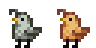

# Coalclaw

Coalclaw is a farm animal that lives in a Coop. It can be purchased at Marnie's Ranch for 550G or hatched by placing an Coalclaw Egg into an Incubator, taking 4,500m (2d 21h 40m) to incubate.

## Variation

There are two variations of Coalclaw. When purchasing from Marnie there is equal chance for both variation to be chosen.

## Produce

Coalclaws who eat every day mature after 2 nights have passed. A mature and fed Coalclaw will produce Coalclaw Clump every day, if the conditions are met. Once sufficient friendship and happiness is reached, Coalclaw has a chance to produce a Large Coalclaw Clump.

Coalclaw Clump and Large Coalclaw Clump cannot be picked up and instead must be destroyed using pickaxe, giving 5 and 7 mining experience respectively. The number of coal produced when destroying the clump is increased by 50% when player has [Prospector](https://stardewvalleywiki.com/Skills#Mining) profession.

| Resource | Min | Max | Avg |
| -------- | --- | --- | --- |
| **Coalclaw Clump** | | | |
| Coal | 4 | 6 | 5 |
| **Large Coalclaw Clump**[1](#LargeCoalclawClump) | | | |
| Coal | 7 | 9 | 8 |

The condition to produce Coalclaw Clump is the same to Pig producing Truffles. Refer to [Pig wiki](https://stardewvalleywiki.com/Pig) page for details. This pig-like behavior means Coalclaw will not produce during rain and winter. However, a config is provided to make Coalclow produce exactly one Coalclaw Clump inside the coop on such day. This is set to 'true' by default.

### Estimation

Here is rough estimate of Coalclow produce in a season. A number between 2 produce to 3 produce per day is probably a reasonable estimate. [Spreadsheet](https://docs.google.com/spreadsheets/d/13k0kkcyTUVJseXhAiZoKnOVubqOB7M9F3xILHV-Sj54/edit#gid=549968683) with the calculation can be accessed and can be used (copy to your Google account to tweak the number) to check the estimate in case player wish to change the default produce quantity.

| Resource | Produce per day: 1 | Produce per day: 2 | Produce per day: 3 |
| -------- | ------------------ | ------------------ | ------------------ |
| **Coalclaw Clump** | | | |
| Coal | 140 | 280 | 420 |
| *With Prospector profession*[2](#LargeCoalclawClump) | 210 | 420 | 630 |
| | | | |
| **Large Coalclaw Clump**[1](#LargeCoalclawClump) | | | |
| Coal | 182 | 364 | 546 |
| *With Prospector profession*[2](#LargeCoalclawClump) | 273 | 546 | 819 |

<a name="LargeCoalclawClump">1</a>: 50% chance to produce when having sufficient friendship and happiness 
<a name="Prospector">2</a>: 50% increase in stack size when having Prospector profession

### Auto Grabber Interaction

If Auto Grabber is placed inside Coop and Coalclaw produce inside the Coop (using appropriate config), Coalclaw Clump and Large Coalclaw Clump will be picked up by the machine. Player can grab the item to inventory, place it on the ground, and interact using appropriate tool to get the resources.

Adding support to place the items into machine for a smoother process with [Automate](https://www.nexusmods.com/stardewvalley/mods/1063) is planned for future update of this mod.

## Configuration

