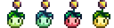

# Honeypuff

> "The puff produces its own honey"

Honeypuff is a farm animal that lives in a Coop. It can be purchased at Marnie's Ranch for 1250G. Honeypuff can become pregnant and give birth.

## Contents

* [Variation](#variation)
* [Produce](#produce)
  * [Calculation](#calculation)
* [Configuration](#configuration)

## Variation

There are four variations of Honeypuff. When purchasing from Marnie there is equal chance for the four variations to be chosen.

## Produce

Honeypuffs who eat every day mature after 3 nights have passed. A mature and fed Honeypuff will produce Honey every other day. 

### Calculation

Here is a calculation of Honeypuff produce in a season. [Spreadsheet](https://docs.google.com/spreadsheets/d/13k0kkcyTUVJseXhAiZoKnOVubqOB7M9F3xILHV-Sj54/edit#gid=549968683) can be accessed and used in case player wish to change the days for produce. To edit the spreadsheet, copy the file to your Google account.

| Resource | Days to produce: 2 | Days to produce: 1 |
| -------- | ------------------ | ------------------ |
| Honey | 14 | 28 |

## Configuration
